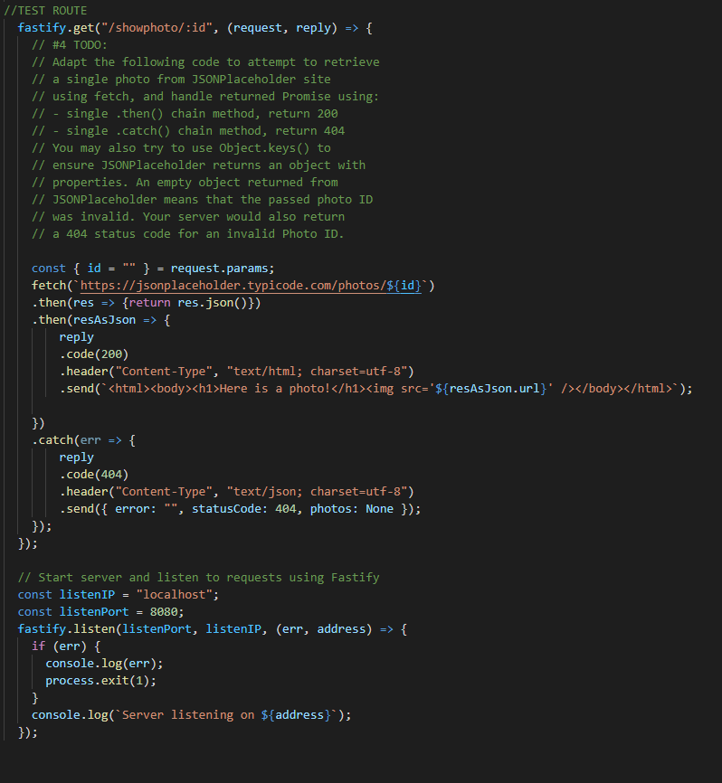

# Welcome to the Cit 281 Lab 8 Page

### What I learned:

- Continuing to work with fastify servers.
- Introduction to the node-fetch package.
- Fetching JSONPlaceholder data from a route.

### Purpose of Lab:

- This lab introduced us to the fetch package from Node.
- We got to include the fetch package into a fastify server, and use fetch to produce an output on a web page.
- We also were able to create different outputs of images depending on the route id inputed in the url.

### Outcome pics: 

### [**Back to home page**](https://uo-cit-itsbread33.github.io/ItsBread33.github.io/)
